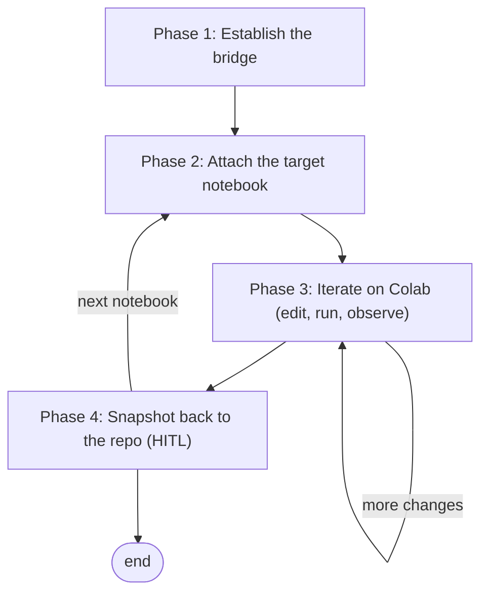

> **Mirror — do not edit here.** This is a verbatim copy of the canonical
> knowledge-base document `kb_mcp://content/workflows/COLAB_MCP_WORKFLOW.md`,
> taken 2026-07-18. It is kept in-repo for offline
> reference. Make changes in the knowledge base and re-copy; edits made here
> will be silently lost on the next sync.

# Colab MCP Integration Workflow

This workflow defines how to run a project's notebooks on **Google Colab's cloud runtime** (with access to Drive-mounted datasets and optional GPUs) from an MCP client, while keeping the **git repository as the single source of truth**. The [Colab MCP server](https://github.com/googlecolab/colab-mcp) bridges the local agent to a Colab notebook open in the browser, exposing tools to add, edit, run, and read cells. The recurring problem it solves: iterating on a notebook against real (often large) data requires Colab's runtime, but Colab notebooks live in Drive and drift from their versioned counterparts in the repo. This workflow closes that loop — author canonical cells in the repo, execute them live on Colab, then snapshot results back — so the repo notebook and its executed output never silently diverge.

It assumes each notebook already carries an **environment switch** (a `RUNNING_LOCALLY`-style flag that mounts Drive and sets data paths on Colab, and adds the repo root to `sys.path` locally). This workflow governs the *outer loop* of moving a notebook between the repo and Colab; it does not prescribe the notebook's internal structure.

**Execution model:** loop — a per-notebook cycle of attach → iterate (edit + run) → snapshot, repeated until the notebook is complete.

**Two execution modes — Mode A is primary.** Phases 2–4 below describe **Mode A** (attach the target notebook's own Colab tab to the bridge), the **preferred** mode: it runs the *actual* repo notebook — markdown cells and all — in the Colab UI, and a human can click *Run* on cells directly. Mode A still hits occasional connectivity trouble on the attach hand-off (the recurring `Unknown tool` symptom), but it remains the better experience. **Mode B — inject-and-run** (see its own section after Phase 4) is a **secondary, deficient fallback** — reach for it only when the Mode A hand-off genuinely can't be made to work. It skips the attach by re-injecting the notebook's *code* cells into the bridge's own scratch tab and merging outputs back by an index map, but that reconstruction is worse than Mode A in three concrete ways (detailed in the Mode B section): it is slow to rebuild the notebook from scratch, it drops the notebook's markdown cells, and it takes running the cells out of your hands (the agent drives every `run_code_cell` through the MCP).

**Prerequisites:**
- The [Colab MCP server](https://github.com/googlecolab/colab-mcp) registered with an MCP client that supports `notifications/tools/list_changed` and runs locally (e.g. Claude Code, Gemini CLI, Windsurf), showing as connected.
- `uv` installed locally (the server runs via `uvx git+https://github.com/googlecolab/colab-mcp`).
- The MCP client's per-tool `timeout` set above `60000` (the connect handshake waits up to 60 s); `90000` is a safe value.
- Signed into the Google account whose Drive holds the project's data and notebooks.
- Each target notebook has an environment switch that mounts Drive and resolves `src`/repo imports on Colab.

**Referenced skills:** [Colab MCP server](https://github.com/googlecolab/colab-mcp) (the bridge and its cell tools) and the project's own notebook-setup convention (the per-notebook environment switch this workflow assumes is in place).

---

## Flow



Phase 1 runs once per session to open the bridge. Phase 2 attaches a specific notebook and is re-entered whenever switching notebooks (the bridge drives one notebook at a time). Phase 3 is the iterative edit/run loop. Phase 4 pulls executed state back to git and is human-gated on the commit. In Mode B, Phase 2 is replaced by Step B.1 (prepare the scratch runtime) and Phases 3–4 by Steps B.2–B.3.

---

## Phase 1 — Establish the bridge

Open the local-to-browser bridge once per working session and record the pairing credentials the rest of the session reuses. The bridge accepts a **single** Colab connection, so any notebook driven later must carry the same token and port.

### Step 1.1 — Open the connection

Call the injected connect tool. It spawns a scratch `empty.ipynb` Colab tab carrying a one-time pairing token, then waits up to 60 s for that tab to hand-shake back.

```text
open_colab_browser_connection()   # returns {"result": true} on success
```

If it returns `false` or times out, see Troubleshooting. Call it **once** per server process — the token/port are stable for the server's life, and every extra call spawns another scratch tab competing for the single connection slot.

### Step 1.2 — Capture the token and port

The pairing token is a server-side secret; it is **not** logged. Read it from the address bar of the scratch tab that just opened:

```text
https://colab.research.google.com/notebooks/empty.ipynb#mcpProxyToken=<TOKEN>&mcpProxyPort=<PORT>
```

Record `<TOKEN>` and `<PORT>` — they are stable for the life of the MCP server process and are reused verbatim in Phase 2 to attach any notebook. A client restart (including a developer reload) respawns the server and regenerates them.

---

## Phase 2 — Attach the target notebook

Point the bridge at the notebook you actually want to run. Loading any Colab tab with the Phase 1 fragment **at page load** makes that tab take over the single connection.

Two properties of the bridge govern this whole phase, and misreading either one costs several wasted attach cycles:

1. **The bridge holds exactly one connection.** A second tab attempting to attach while another holds the slot is rejected (`too many open connections`), and the holder keeps the slot.
2. **Closing the connected tab necessarily drops the bridge.** Every cell tool then fails with `Unknown tool` until some tab reattaches. **This is expected and recoverable — it is not the fatal hand-off failure**, even though it produces an identical symptom. Do not respond to it by re-running `open_colab_browser_connection` (see Phase 1); respond by loading the target notebook with the fragment.

Together these force the ordering in Step 2.2: you must free the slot *before* the target can take it, and freeing it always looks briefly like a broken bridge.

### Step 2.1 — Choose the notebook source

| Source | URL base | Trade-off |
|:---|:---|:---|
| GitHub (reflects pushed repo state) | `https://colab.research.google.com/github/<owner>/<repo>/blob/<branch>/<path>` | Cannot save back to GitHub; snapshot via Phase 4 |
| Drive copy | `https://colab.research.google.com/drive/<fileId>` | Autosaves to Drive; risks divergence from git |
| Scratch (new exploration) | `https://colab.research.google.com/notebooks/empty.ipynb` | Ephemeral; build cells via MCP, then write into the repo |

Prefer the **GitHub** source for existing repo notebooks so Colab loads exactly what git holds (push local edits first). URL-encode the path — a notebook whose filename contains spaces needs `%20`, or the tab will not load at all.

**The source does not affect the attach (confirmed).** A GitHub-loaded notebook attaches exactly as reliably as a Drive copy — the two are interchangeable for pairing purposes, so choose between them on the git-vs-autosave trade-off above, not on connection reliability. This was tested directly: after two failed GitHub attach attempts a Drive copy succeeded, suggesting the read-only GitHub view was at fault, but a subsequent **clean GitHub attach with correct Step 2.2 ordering succeeded on the first try**. The earlier failures were confounded — both used the wrong ordering. **When an attach fails, suspect the ordering, not the source**; switching to a Drive copy to "fix" a hand-off treats a symptom and silently trades away git-as-source-of-truth for nothing.

### Step 2.2 — Open with the pairing fragment (order matters)

**The fragment is read at page load only.** Appending `#mcpProxyToken=...` to an already-open tab fires a hashchange that the bridge never observes, so editing the address bar of a loaded notebook does **not** attach it. The attach must be a genuine page load carrying the fragment.

Follow this order exactly:

1. **Free the slot** — close whichever Colab tab currently holds the connection (typically the Phase 1 scratch tab). The bridge drops and every cell tool returns `Unknown tool`. Expected; continue.
2. **Load the target with the fragment**, as a fresh page load (new tab, or paste the full URL and force-reload — not a bare hashchange):

   ```text
   <notebook-url>#mcpProxyToken=<TOKEN>&mcpProxyPort=<PORT>
   ```

   Exactly **one** `#` may appear in the URL. Colab often appends its own fragment (e.g. `#scrollTo=...`); delete from the existing `#` onward before pasting, or the URL carries two fragments and the attach silently fails.
3. **Confirm with Step 2.3** before touching cells.

The token/port are unchanged from Phase 1, so the same fragment attaches any tab.

### Step 2.3 — Confirm the attachment

Verify the bridge is now driving the intended notebook before touching cells:

```text
get_cells(includeOutputs=false)   # should list the target notebook's cells, not the empty scratch cell
```

**Give the tab ~30 s before judging.** The attach completes only once the Colab page has fully loaded, so a `get_cells` fired immediately after opening the URL returns `Unknown tool` for the mundane reason that nothing has loaded yet. That is indistinguishable from a failed attach and is the single easiest way to abandon a hand-off that was about to succeed — wait, re-check, and only then diagnose.

**`get_cells` is the diagnostic that separates the two failure states**, which demand opposite responses — check it before changing anything:

| `get_cells` returns | State | Response |
|:---|:---|:---|
| The target notebook's real cells | Attached | Proceed to Phase 3 |
| The single empty **scratch cell** | Another tab (usually scratch) still holds the slot; the target was refused | Close the holding tab, then re-load the target per Step 2.2 |
| `Unknown tool` | **No tab holds the connection** — the bridge has no connection and the cell tools are deregistered | Load the target with the fragment as a fresh page load (Step 2.2). Do **not** call `open_colab_browser_connection` unless no Colab tab is open at all |

If a GPU is needed, set **Runtime → Change runtime type → GPU** in the Colab tab; the bridge survives the reconnect.

---
## Phase 3 — Iterate on Colab (edit, run, observe)

Run and refine the notebook against the live runtime. Canonical *code* changes are authored in the repo `.ipynb` (via a notebook editor) and mirrored onto Colab; Colab is the executor, not the author of record.

**Division of labor — the human drives, the agent monitors (default).** Because Mode A attaches the real notebook in the Colab UI, the human can click *Run* directly, and that is the **default**: the human executes cells; the agent **does not call `run_code_cell`** unless asked. The agent's job is to observe and report — poll `get_cells(includeOutputs=true)` on a timer, distinguish still-running from finished from crashed (Step 3.3), surface errors with the failing cell id, and flag decisions that must be made before a later cell writes anything. Being able to run cells yourself is the main practical advantage Mode A has over Mode B; an agent that drives every cell discards it.

The exception is opt-in: when the human explicitly delegates execution (unattended runs, long batch sequences, or a mechanical re-run after a fix), the agent drives with `run_code_cell` and polls per Step 3.3. Agree which applies before starting the phase — and note the asymmetry, since it is what makes the default safe: an agent that wrongly stays idle costs a prompt, whereas an agent that wrongly runs a cell can queue duplicate executions on the single kernel or overwrite checkpointed results.

### Step 3.1 — Run the Setup section

Execute the notebook's Setup cells first (Drive mount, repo clone, imports) so paths and repo imports resolve, per the project's notebook-setup convention. Mounting Drive triggers a one-time auth prompt in the Colab tab.

**Missing dependencies.** The Colab base image periodically drops packages the notebooks assume (e.g. `gensim`). On a `ModuleNotFoundError`, add a Colab-guarded install cell and re-run — this fix is part of what Phase 4 snapshots back:

```text
if not RUNNING_LOCALLY:
    !pip install -q <package>
```

Do **not** pin a transitive dependency down (e.g. `scipy<1.13`) to force compatibility — on current Colab that downgrades `numpy` and breaks the runtime. Install the package plain; if a version change to `numpy`/`scipy` is genuinely needed, install it, then **Runtime → Restart session** (the bridge survives a kernel restart) and re-run.

### Step 3.2 — Edit and execute

Use the Colab MCP tools against the attached notebook:

```text
add_code_cell(cellIndex, language="python", code=...)
update_cell(cellId, content=...)
run_code_cell(cellId)             # returns stdout / outputs
get_cells(cellIndexStart, cellIndexEnd, includeOutputs=true)
```

Keep any *code* change reflected in the repo `.ipynb` so git stays canonical. Loop within this phase until the cells behave as intended.

### Step 3.3 — Driving long-running cells

Cell execution is **decoupled from the MCP call**: `run_code_cell` returns after ~90 s even though the cell keeps running on the Colab kernel. A heavy cell — a full-dataset pass, `drive.mount` waiting on auth, a large graph/model write — therefore surfaces as a `timed out after 90s` error while it is in fact **still executing**. Do **not** re-run it; that would queue a second execution behind the first.

Instead, poll the cell:

```text
get_cells(cellIndexStart=<n>, cellIndexEnd=<n>, includeOutputs=true)
```

- **Still running** while `execution_count` is `null`; the latest `tqdm`/stderr line streams into the cell's outputs after it has run a while (it may be empty for the first several seconds).
- **Done** when `execution_count` flips from `null` to a number and the final printed output appears.
- **Crashed** if an `error` output with a traceback appears — check for this rather than assuming "still running".

**The output stream lags — trust `execution_count`, not stdout.** The bridge refreshes a running cell's captured stdout/stderr in bursts, so on a long cell the last visible line can sit **unchanged for many minutes** while the kernel is still advancing (or has already finished and the flush simply hasn't arrived). Do not read a stalled last line as a hang, and do not re-run. The reliable done-signal is `execution_count` flipping from `null` to a number — watch that, not the streamed text. Heavy cells legitimately run for many minutes: a full-resolution raster render, a large-graph layout, or serializing millions of rows into an interactive widget can each take 5–15 min, and diffuse layouts render several times slower than compact ones. Poll on a timer and stay patient. For a genuinely long silence, a human can glance at the Colab tab, whose live spinner and RAM gauge reflect the true kernel state better than the lagged bridge output.

Cells run **sequentially on one kernel**, so you cannot slip a separate check cell in while a long one runs — it queues behind it. Poll the running cell itself. For multi-hour cells, check back on a timer instead of holding the call open.

---

## Phase 4 — Snapshot back to the repo

```yaml
hitl_gate: true
```

**Mandatory before leaving a notebook — do not skip.** Snapshot the *executed* notebook back into the repo **before** switching to another notebook (re-entering Phase 2) or ending the session. A GitHub-loaded notebook cannot be saved back to GitHub, and Colab does not auto-save it to Drive, so **closing or switching its tab permanently discards the executed state** — printed outputs, rendered plots, and any cells added or modified live during Phase 3. Capturing that state is the whole point of the loop; treat an un-snapshotted notebook as unfinished work, and never close its tab until Step 4.2 has written its executed cells into the repo `.ipynb`.

Reconcile the executed notebook into git, then let the human approve the commit. This is the gate that keeps git authoritative; a human must confirm the diff and authorize any `git` write (each commit is approved on its own).

**The bridge is not a durable capture channel — never rely on it surviving a long run.** Pairing dies for reasons outside the run: the MCP server restarting (client reload, crash, or host process exit) regenerates the token/port, and re-pairing requires a page load, which for a GitHub-loaded notebook **re-fetches from GitHub and destroys every executed output**. There is no way to reattach without that page load, so a mid-run bridge loss makes the outputs unrecoverable through the MCP. Two consequences:

- **Long or unattended runs must persist their own results.** The notebook itself should write CSVs / figures / checkpoints to Drive as it goes (ideally per unit of work, so a disconnect costs at most the in-flight unit). Those artifacts survive the bridge, the tab, and the kernel. Cell outputs are a *readability* convenience layered on top — never the only copy of a result.
- **Prefer the Drive source for runs long enough to outlive a session** (Step 2.1). A Drive-hosted notebook autosaves its outputs, so a lost tab is recoverable; a GitHub-loaded one is not. This cuts against the git-purity argument for the GitHub source, and for multi-hour runs durability wins — Phase 4 re-establishes git as the source of truth afterwards either way.

### Step 4.1 — Pull the executed state

**Preferred — `File → Download → Download .ipynb` from the Colab tab.** This yields the complete executed notebook (every output and figure, exactly as it ran) as one local file. It requires **no bridge**, so it still works after the kernel disconnects, after the MCP server dies, and after tools deregister — the only requirement is that the tab is still open. It is also an exact copy rather than a reconstruction, so no cell can receive the wrong outputs.

**Fallback — `get_cells(includeOutputs=true)`.** Use only when the tab is unreachable but the bridge is somehow alive. Two practical limits make this a poor fit for a real notebook:

- **Payload size.** Outputs embed base64 figures; single-cell responses routinely exceed the tool's inline limit and spill to disk. Retrieval then means fetching in ranges and reassembling from spill files — parse them with a script rather than reading them into context.
- **Reassembly risk.** Merging fetched outputs into repo cells is keyed by cell id, so it must verify that each Colab cell's source still matches the repo cell's (whitespace-normalized) before attaching its outputs. **A mismatch must abort that cell, never guess** — outputs landing on the wrong cell is silent corruption. A stale payload captured before a mid-session cell edit will fail exactly this check.

### Step 4.2 — Write into the repo notebook

Reconcile the retrieved cells into the repo `.ipynb` with a notebook editor. For a GitHub-loaded notebook this captures the run; for a Drive-loaded notebook it re-establishes git as the source of truth over the Drive copy.

**Preserve the Colab cell shape.** Colab-flavored notebooks (`nbformat_minor: 0`) keep each cell's id at `metadata.id` — not as a top-level `id` field — and Colab's loader hard-crashes (`TypeError: Cannot read properties of undefined (reading 'id')`) on any cell missing the `metadata` key, leaving the notebook unloadable from GitHub. When a snapshot rewrites cells, never strip `metadata` or relocate ids to the top level; a repo-level notebook lint should verify every cell carries a `metadata` dict. Validate with `nbformat.validate` before committing.

**Decide whether outputs belong in git.** Embedding them keeps figures beside the code that produced them, which makes the record far more interpretable — but it can add megabytes per notebook. Follow the repo's existing convention; if it stores source-only notebooks, capture the compact text outputs (tables, regression summaries) and leave regenerable figures to the Drive artifacts.

### Step 4.3 — Human-approved commit

Present the notebook diff and the one-line intent. On approval, commit and (if desired) push so the next Colab open from GitHub reflects the update. Do not run any `git` write without explicit approval. Stage the notebook explicitly rather than with `git add -A` — an executed-notebook commit is easy to bloat with unrelated working-tree changes.

---
## Mode B — Inject-and-run (attach-free scratch drive)

**Secondary mode — prefer Mode A.** Mode B is a fallback for when the Mode A attach can't be made to work, not a first choice. Its reconstruction of the notebook is deficient in three ways: (1) **slow** — it rebuilds the notebook cell-by-cell from scratch, far slower than attaching the real one; (2) **markdown is lost** — only code cells are injected, so the notebook's narrative never reaches Colab; (3) **no manual runs** — the agent drives every cell through the MCP, so you can't just click *Run* yourself. Use it only after Mode A has genuinely failed.

Mode A's weak point is the hand-off: the target tab must seize the bridge's single connection slot, and a botched hand-off leaves every cell tool returning `Unknown tool`. The two *observed* causes are both procedural — attaching while another tab still holds the slot, and attempting the attach by hashchange instead of a page load — so **exhaust Step 2.2's ordering before concluding Mode A cannot work** (an earlier version of this document blamed a missing live runtime; that was never established and the ordering fix superseded it). Mode B never hands off. The scratch `empty.ipynb` tab spawned by `open_colab_browser_connection` auto-connects a runtime and holds the bridge from the start; the agent drives *it* directly, treating the repo `.ipynb` as the author of record and the scratch tab as a disposable executor. Validate the loop first with a minimal proxy notebook (a `print`, an environment check, a guarded GPU check) before driving a real one.

### Step B.1 — Prepare the scratch runtime

The scratch tab is already connected (CPU by default). If the run needs a GPU: **Runtime → Change runtime type → GPU → Connect** in the scratch tab — the bridge survives the runtime swap. Confirm the bridge responds with `get_cells` (a single empty cell).

### Step B.2 — Inject and run with an index map

Read the repo `.ipynb` locally and inject its **code cells in order** with `add_code_cell` (markdown cells are skipped — they don't execute). Record one mapping row per injected cell:

```text
repo cell id  →  colab cell id (returned by add_code_cell)  →  colab index
```

Run each cell with `run_code_cell`, polling long cells exactly as in Step 3.3. Live fixes are applied with `update_cell` on Colab **and mirrored into the repo `.ipynb` immediately** with a notebook editor — the repo stays canonical; never let the scratch copy drift.

### Step B.3 — Snapshot outputs back (the retrieval pipeline)

Scratch cells are new objects with their own ids, so nothing can be saved from the Colab side; outputs are pulled through the bridge and merged into the repo notebook **by the map**:

1. `get_cells(includeOutputs=true)`.
2. For each mapping row, verify the Colab cell's source still equals the repo cell's source (whitespace-normalized). **A mismatch aborts the merge for that cell** — outputs must never land on the wrong cell.
3. Copy `outputs` + `execution_count` into the matched repo cell (local JSON edit of the `.ipynb`).
4. Human-approved commit, exactly as Step 4.3.

The map is positional (only code cells were injected, order preserved); the source-equality check in step 2 is what makes the merge safe rather than hopeful.

---

## Example — End-to-end on one notebook

Running a repo notebook (`notebooks/<path>/<notebook>.ipynb`) on Colab and snapshotting the result back to git.

```text
# Phase 1 — bridge (once per session)
open_colab_browser_connection()                    -> {"result": true}
# read scratch tab address bar:
#   ...empty.ipynb#mcpProxyToken=<TOKEN>&mcpProxyPort=<PORT>
# record TOKEN and PORT

# Phase 2 — attach the repo notebook from GitHub
# open in browser:
#   https://colab.research.google.com/github/<owner>/<repo>/blob/<branch>/notebooks/<path>/<notebook>.ipynb#mcpProxyToken=<TOKEN>&mcpProxyPort=<PORT>
get_cells(includeOutputs=false)                    -> lists the notebook's real cells

# Phase 3 — run the experiment
run_code_cell(<compute cell id>)                   -> ModuleNotFoundError: No module named 'gensim'
# fix live: insert a Colab-guarded install cell
add_code_cell(cellIndex=1, language="python",
              code='if not RUNNING_LOCALLY:\n    !pip install -q gensim')
run_code_cell(<install cell id>)                   -> package installed
# Runtime -> Restart session (only if a pip install changed numpy/scipy), then:
run_code_cell(<compute cell id>)                   -> expected outputs

# Phase 4 — snapshot back to git (HITL)
get_cells(includeOutputs=true)                     -> final cells + outputs
# edit the repo .ipynb to match, then present diff, get approval, commit
```

The token and port above are placeholders — read the current session's values from the scratch tab (Step 1.2).

---

## Decision Points & Branches

| Condition | Action |
|:---|:---|
| Switching to a different notebook | **Snapshot the current notebook first (Phase 4)** — closing its tab discards executed state — then re-enter Phase 2 with the same token/port; the new tab takes over the single connection |
| Exploratory work with no repo notebook yet | Build cells in the scratch notebook (Phase 3), then create a repo `.ipynb` in Phase 4 |
| MCP server restarted (client reload) | Token/port are regenerated — redo Phase 1 to get fresh values |
| Heavy compute (embeddings, model training) | Set GPU runtime in Step 2.3 (Mode A) or Step B.1 (Mode B) before running Phase 3 |
| Mode A attach fails with `Unknown tool` | Switch to **Mode B** (inject-and-run). Do **not** keep re-calling `open_colab_browser_connection` — each call spawns another scratch tab competing for the single slot |

---

## Future Extension — Google Drive MCP

A [Google Drive MCP](https://github.com/isaacphi/mcp-gdrive) may be incorporated alongside this workflow to streamline the parts still handled manually — chiefly **shuttling small artifacts** (a trained model, an analysis output, a results CSV) between Drive and the repo without hand-downloading. It is **not required**: code sync is already handled by git (repo clone on Colab / GitHub loader / local edits), and large datasets should stay in Drive behind the notebook's Drive mount rather than route through an MCP. Adopt a Drive MCP only if artifact-fetching becomes a recurring friction; the Colab MCP plus git remains the backbone.

---

## Quick Reference Checklist

- [ ] Colab MCP connected; per-tool `timeout` > 60000.
- [ ] Phase 1 done: `open_colab_browser_connection()` returned `true`; TOKEN and PORT recorded.
- [ ] Phase 2 done: previous tab closed; target notebook opened with the pairing fragment; `get_cells` confirms the right notebook. (Mode B instead: scratch tab confirmed, GPU set if needed, index map started.)
- [ ] Setup section run on Colab (Drive mounted, repo cloned, imports OK).
- [ ] Iteration complete; code changes reflected in the repo `.ipynb`.
- [ ] Executed state snapshotted back to git; commit human-approved.

---

## Troubleshooting

| Symptom | Cause | Fix |
|:---|:---|:---|
| Connect tool times out at 30 s | MCP client `timeout` shorter than the 60 s handshake | Set the per-tool `timeout` to `90000`, reload the client |
| Connect returns `false` | Scratch tab did not load / not signed in | Ensure the spawned Colab tab finishes loading while signed into Google, retry |
| No `#mcpProxyToken=...` in the scratch tab | Colab stripped the fragment | Redo Phase 1; if still absent, the token is unrecoverable — work in the scratch notebook and Save-a-copy to Drive |
| `too many open connections` when opening a notebook | The previous Colab tab still holds the single connection | Close the currently-connected tab, then re-open the new notebook URL with the fragment |
| `get_cells` shows the empty scratch cell, not your notebook | The target tab never took over the connection | Re-open the notebook URL with the correct token/port fragment as a fresh page load (Step 2.2); see the Step 2.3 diagnostic table |
| Nothing attaches after appending the fragment to an already-open notebook tab | **The fragment is read at page load only** — editing the address bar of a loaded tab fires a hashchange the bridge never observes | Force a real page load carrying the fragment (new tab, or paste the full URL and reload) — Step 2.2 |
| Attach silently fails and the URL contains two `#` | Colab had already appended its own fragment (e.g. `#scrollTo=...`) and the pairing fragment was appended after it | Delete from the first `#` onward, then paste the pairing fragment so exactly one `#` remains (Step 2.2) |
| Notebook won't load from GitHub at all — `TypeError: Cannot read properties of undefined (reading 'id')` before any cell renders (attach and manual open both fail) | One or more cells lack a `metadata` key — Colab's loader reads `cell.metadata.id`. Typically caused by a hand-rolled snapshot that wrote nbformat-4.5-style top-level `id`s and dropped `metadata` (Step 4.2) | Move each cell's id into `metadata: {"id": ...}` (no top-level `id` for `nbformat_minor: 0`) and give every cell a `metadata` dict; commit and reload from GitHub |
| Notebook URL 404s / never loads, filename has spaces | The path was not URL-encoded | Replace spaces with `%20` in the `/github/...` path (Step 2.1) |
| `ModuleNotFoundError` on Colab (e.g. `gensim`) | Colab base image dropped the package | Add a `if not RUNNING_LOCALLY: !pip install -q <pkg>` cell, re-run (Step 3.1) |
| `No module named 'numpy.rec'` / numpy version mismatch after a pip install | A pinned dependency downgraded numpy/scipy | Remove the pin (install plain); Runtime → Restart session, then re-run — the bridge survives |
| `CUDA available: False` for heavy work | Runtime is CPU | Runtime → Change runtime type → GPU, then reconnect |
| Every cell tool returns `Unknown tool` | **Usually just that no tab holds the connection** — closing the connected tab always deregisters the cell tools. Token/port are unchanged. Only a genuine MCP server restart regenerates them | Load the target notebook with the existing fragment as a fresh page load (Step 2.2). Redo Phase 1 **only** if no Colab tab is open at all; a client restart is needed only if tools stay unregistered against a fresh scratch tab |
| `run_code_cell` returns `timed out after 90s` on a heavy cell | The MCP call caps at ~90 s; the cell keeps executing on the kernel | Don't re-run. Poll `get_cells(includeOutputs=true)`; done when `execution_count` flips from `null` to a number (Step 3.3) |
| No `tqdm` progress bar while a long cell runs | stderr streams through the bridge with lag and isn't in the tool's return value | Poll `get_cells(includeOutputs=true)` — the latest stderr line appears in the cell's outputs once it has run a while |
| A running cell's output looks frozen on one line for many minutes | The bridge flushes captured stdout/stderr in bursts, lagging far behind the kernel | Don't assume it's hung or re-run it. Poll `get_cells(includeOutputs=true)`; done when `execution_count` flips `null`→number. Heavy render / layout / widget-serialization cells can legitimately take 5–15 min; a human can confirm true state from the Colab tab's spinner/RAM gauge |
| Bridge lost after rearranging the Colab tab | The tab was closed or reloaded | Moving a tab to a new window is safe; only close/reload drops pairing — redo Phase 2 to re-attach |
| Mode A hand-off repeatedly drops the bridge (`Unknown tool` every time the notebook tab takes over) | **First suspect the Step 2.2 ordering** — the two known causes are attaching while another tab still holds the slot, and attempting the attach by hashchange rather than a page load. Only after both are ruled out is the tab genuinely failing to hold the slot | Retry once with the exact Step 2.2 order (free the slot, then fresh page load with the fragment) and confirm via the Step 2.3 table. If that fails, try a Drive copy (Step 2.1). Only then fall back to **Mode B**, which never hands off. If tools stay unregistered even against a fresh scratch tab, fully restart the MCP client (a developer reload is insufficient) |
